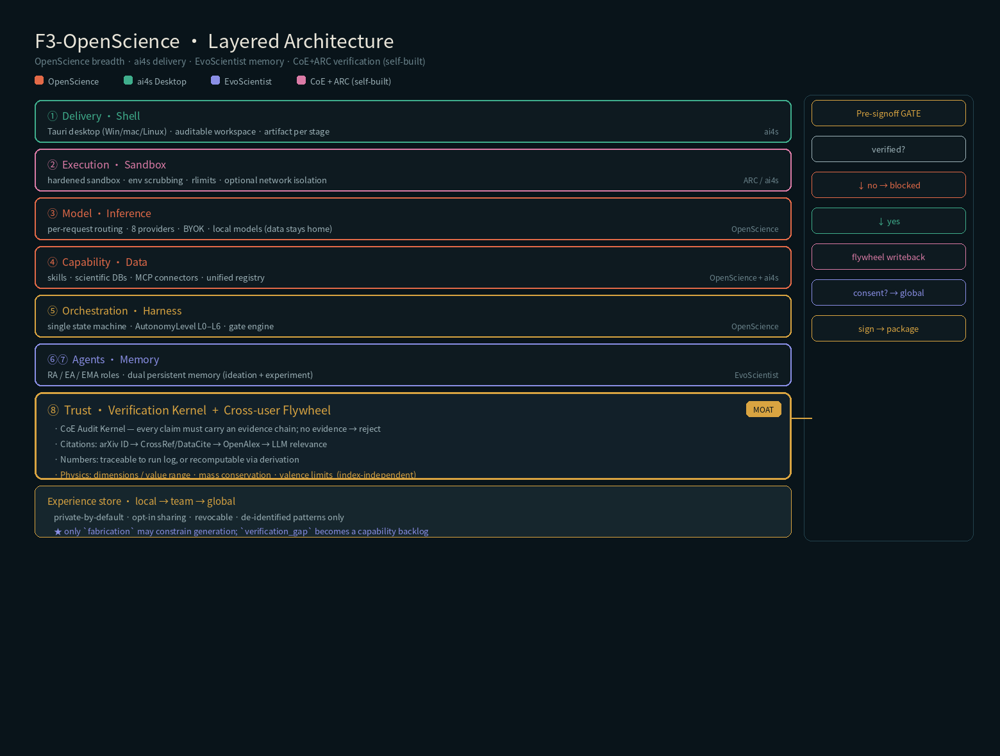
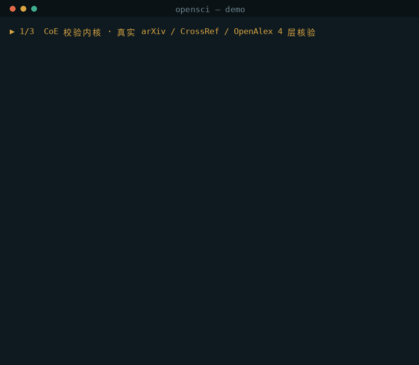
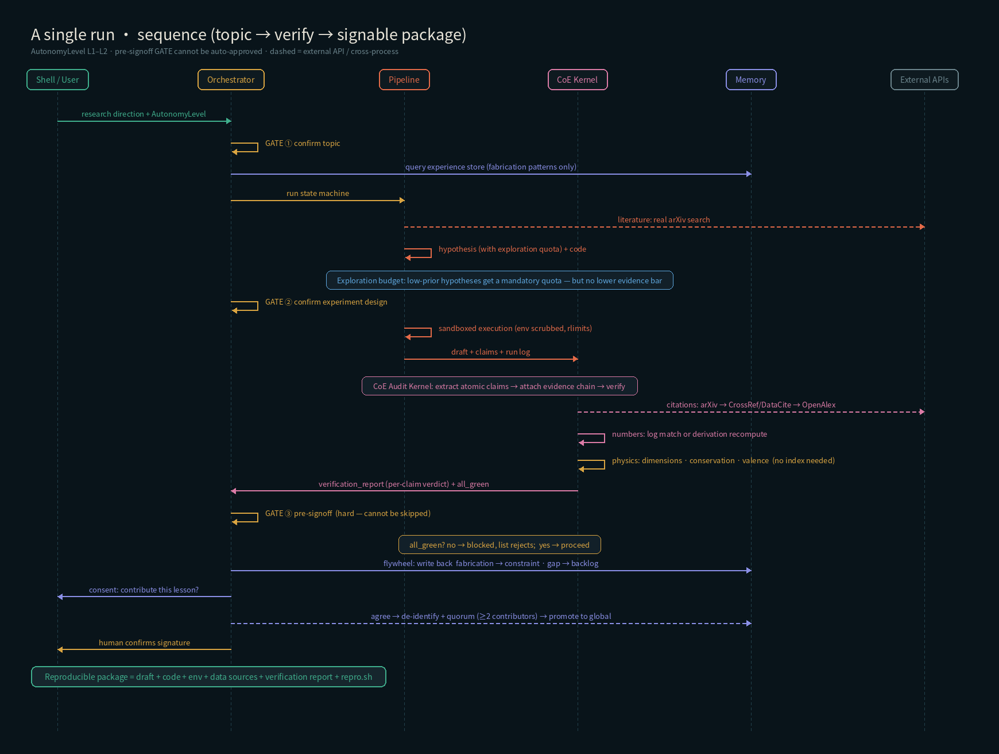

<div align="center">

# F3-OpenScience

**Sign your name to it — without narrowing what you can reach**

**敢署名,且不因此变窄**

*The first open-source research agent with independent pre-output verification — and the first to show that verification did not cost it the ability to explore.*

*第一个产出前有独立校验的开源科研 Agent —— 也是第一个证明了自己没有因为校验而丧失探索能力的系统。*

`0 false-rejection on 7 known-valid claims` · `0 missed fabrication on 4 known-fabricated` · `verification-memory flywheel` · `reachability guarantee` · `model-agnostic` · `self-hostable`

[](https://github.com/MedocMay/F3-OpenScience/actions/workflows/ci.yml)
[](LICENSE)
[](pyproject.toml)
[](tests/)
[](docs/DEPLOY.md)
[](STATUS.md)

*This README is bilingual — English first, 中文在后。*

</div>

---

> ### ⚠️ Read this first · 请先读这一段
>
> **This project was built under resource constraints and has not been comprehensively tested.
> It is a working research prototype, not a production-ready product.**
>
> In particular: it has **never been run end-to-end with a real LLM**, and has
> **never produced an actual research result** — the development environment had no model API
> credentials, and the generation stage of the pipeline is templated. The verification layer,
> the flywheel, and the reachability mechanisms are all empirically tested; but "an AI actually
> writing a research draft" is itself unverified. The desktop app builds in CI but has never
> been run — nobody has installed an artifact and opened the window; the macOS/Windows
> installers are unsigned. The Docker orchestration layer has never been run.
> Windows / macOS install scripts were only statically checked. Security has not been
> independently audited. Scale and performance are untested.
>
> **本项目在资源受限条件下开发,尚未经过全面测试,是可运行的研究原型,不是生产就绪的产品。**
>
> 特别地:**从未用真实 LLM 端到端跑过**,也**从未产出过一篇真实研究成果** ——
> 开发环境无模型 API 凭据,Pipeline 的生成环节是模板化的。校验层、飞轮、可达性机制都经过实测;
> 但「AI 真的写出一篇研究草稿」这件事本身没有被验证。桌面应用能在 CI 里构建,但**从未运行过** ——
> 没有人装过安装包、打开过窗口,而且 macOS/Windows 安装包均未签名。Docker 编排层从未运行过,
> Windows / macOS 安装脚本仅静态校验,安全未经独立审计,规模与性能完全未测。
>
> **完整验证边界见 [STATUS.md](STATUS.md) —— 请务必阅读后再决定如何使用。**

---

## What this is · 这是什么

F3-OpenScience integrates four open-source projects to supply the one piece the open-source
research-agent ecosystem was missing: **independent verification before output**.

Research output carries your name, and your name carries responsibility. Today's AI research
tools can do the legwork — literature review, data cleaning, analysis, figures, drafting —
but open-source options generally have **no independent verification**: one wrong citation or
one invented number, and it is your credibility that pays.

F3-OpenScience blocks untrustworthy content before output using **deterministic auditing**
rather than model self-restraint, and turns each intercepted error into reusable, cross-user
experience — so **the interception rate falls the more you use it**.

F3-OpenScience 整合四个开源项目,补上开源科研 Agent 唯一缺的那块拼图 —— **产出前的独立校验**。

科研产出要署名、署名要负责。当前 AI 科研工具能把查文献、清数据、跑分析、出图、写稿的活干完,
但开源方案普遍**没有独立校验**:错一个引用、编一个数字,砸的是你的信誉。

F3-OpenScience 在产出前用**确定性审计**(而非模型自律)拦住不可信内容,
并把每次拦下的错误沉淀成经验、跨用户复用 —— **拦截率越用越低**。



---

## Core mechanism · 核心机制

### ① Verification-memory flywheel · 校验记忆飞轮

```
rejected pattern → distilled into a de-identified pattern → experience store (local→team→global)
   → pre-injected into the next generation → interception ↓ → increasingly "right the first time"

被拒模式 → 提炼成脱敏抽象模式 → 经验库(local→team→global)
   → 前置注入下次生成 → 拦截率↓ → 越用越「一次过」
```

### ② The guarantee against narrowing ★ · 不收窄的保证 ★

Every "verify + remember" system shares one hidden defect:
**the verifier's capability boundary quietly becomes the generator's world boundary.**
The system learns to route around whatever is hard to verify — citing only easily indexed
literature, stating only numbers it can print verbatim. And "interception rate is falling"
cannot tell you whether the system learned to stop fabricating, or merely learned to dodge.

所有「校验 + 记忆」的系统都有同一个隐藏缺陷:
**校验器的能力边界,会悄悄变成生成器的世界边界。**
系统会学会绕开难以校验的区域 —— 只引用容易检索的文献、只陈述能字面打印的数字。
而「拦截率下降」这个指标,分辨不出它是学会了不再捏造,还是学会了绕开难题。

We split failure into two kinds, and **only the first may constrain generation**:
我们把失败分成两类,**只有前者可以约束生成器**:

| | Meaning · 含义 | May constrain generation?<br>可否约束生成 |
|---|---|---|
| `fabrication` | An authoritative registry confirms non-existence — **the world disallows it**<br>权威登记处确证不存在 —— **世界不允许** | ✅ |
| `verification_gap` | Not covered by our index — **we simply cannot see it**<br>索引未覆盖 —— **只是我看不到** | ❌ → capability backlog<br>转为能力建设待办 |

```sql
inject()  WHERE lesson_class = 'fabrication'
-- the one line that breaks the cage · 破牢笼的那一行
```

The signing bar is **not** relaxed: `reject` / `unresolved` / `manual` each block signing.
What changes is only whether a failure earns the right to shape generation preferences.

**署名门槛一点没放松**:`reject` / `unresolved` / `manual` 任一存在都阻断署名。
改变的只是 —— 它是否有资格塑造生成偏好。

→ [docs/REACHABILITY.md](docs/REACHABILITY.md)

---

## Quick start · 快速开始

> **Every command below assumes an activated virtualenv.** A new terminal needs it again.
> **下面每条命令都假设虚拟环境已激活。** 每开一个新终端都要重新激活一次。

```bash
# 0) Setup — once per machine · 每台机器做一次
python3 --version                  # must be 3.11+ · 必须 3.11 以上
python3 -m venv .venv
source .venv/bin/activate          # ← every new terminal · 每个新终端都要
pip install -e '.[test]'           # core is stdlib-only; this adds test deps
                                   #   核心零第三方依赖,这步只装测试依赖

# 1) Check the environment BEFORE running anything · 跑任何东西之前先体检
make doctor

# 2) Run the tests (needs network: real arXiv / CrossRef / OpenAlex)
#    跑测试(需网络:真实 arXiv / CrossRef / OpenAlex)
make test

# 3) The narrowing experiment — the shortest path to seeing what this project claims
#    收窄实验 —— 看清本项目主张的最短路径
python experiments/narrowing/run_experiment.py

# 4) End-to-end demo (verification → flywheel → multi-process chain → reproducible package)
#    端到端演示(CoE 校验 → 飞轮闭环 → 多进程链路 → 可复现包)
bash demo.sh

# 5) TS brain driving Python sidecars · TS 大脑驱动 Python sidecar
cd orchestrator-ts && npm i && npm start

# 6) Desktop shell (requires Rust) · 桌面壳(需 Rust 工具链)
cd apps/shell && npm i && npm run tauri build
```

`make doctor` reports at three levels: **blocking** (wrong Python, missing certificates,
missing test deps), **degraded** (an index API is rate-limiting you — everything still runs,
but the narrowing experiment will report NOT ELIGIBLE), and **advisory**. It checks
capability rather than connectivity: not "can I reach arXiv?" but "can I get a definitive
negative for an ID that does not exist?"

`make doctor` 分三档报告:**阻塞**(Python 版本、证书、测试依赖)、**受损**(索引 API 限流 ——
一切照跑,但收窄实验会报不适格)、**提醒**。它查的是能力而非连通性:不是「能否连上 arXiv」,
而是「能否对一个不存在的 ID 得到明确否定」。



Setup guide · 安装指引:[docs/INSTALL.md](docs/INSTALL.md) ·
Real run transcript · 真实运行录屏:[docs/DEMO.md](docs/DEMO.md)

---

## Architecture · 架构

```
apps/shell/          Tauri desktop shell · Tauri 桌面壳(工作区 + gate 确认 + 主权面板)
orchestrator-ts/     Orchestrator (TS brain) · TS 大脑:状态机 + 自主度 + gate + 飞轮
orchestrator/        Python reference implementation · 同一大脑的 Python 参考实现
model/               Model-agnostic router · 模型无关路由层(6 云 + 本地 Ollama/vLLM)
coe_kernel/          ★ Verification kernel · 校验内核:证据链门控 + 4 层引用核验
                       + 推导重算 + 量纲 + 领域物理
memory/              ★ Experience store + flywheel · 经验库与飞轮:三级 SQLite + 脱敏 + 治理
pipeline/            Research mainline · 研究主线:检索 → 假设(含探索配额)→ 代码 → 沙箱执行
cloud/               Multi-tenant · BYOK vault · hardened sandbox · 多租户 / 密管 / 沙箱
deploy/              Three deployment modes · 三种部署:网关 · global 服务 · Docker/Compose
contracts/           Cross-process contracts · 跨进程契约,语言无关的唯一真源
generated/           Auto-generated type bindings · 由契约自动生成的两端类型(勿手改)
```

The brain (TS) and the sidecars (Python) communicate only through the JSON-RPC contracts in
`contracts/` — process-isolated, crash-isolated, cross-language.

大脑(TS)与 sidecar(Python)只通过 `contracts/` 的 JSON-RPC 通信 —— 进程隔离、崩溃隔离、可跨语言。



---

## The verification layer · 校验层(护城河核心)

CoE Audit Kernel — every claim must carry an **evidence chain**; no evidence means rejection.
CoE 审计内核 —— 每条论断必须挂**证据链**,无据即拒。

| Claim type · 论断类型 | Verification · 核验方式 |
|---|---|
| Citation · 引用 | ① arXiv ID ② CrossRef/DataCite DOI ③ OpenAlex title match ④ LLM relevance |
| Number · 数字 | Traceable to the run log, **or** recomputable from a derivation<br>在运行日志有据,**或**可由推导式重算 |
| Figure · 图表 | Figure ↔ code consistency · 图↔码一致性(数据回指) |
| Mechanism · 机制命题 | In literature → citation OK; absent from index → computational evidence required<br>文献有支撑→引用可;索引无支撑→须计算型证据 |
| Domain physics · 领域物理 | Mass conservation, unsaturation, valence limits (pluggable)<br>质量守恒 · 不饱和度 · 价键上限(可插拔) |

**Deterministic retrieval leads; the LLM does only the small relevance step — the verifier does
not trust the generator.** Target: 0 hallucinated citations.

**确定性检索为主,LLM 只做相关性一小步 —— 校验器不信任生成模型。** 目标:0 幻觉引用。

**Four criteria depend on no index at all** — derivation recomputation (computational
contradiction), dimensional / value-range checks, and domain physics. The judge has migrated
from bibliography (*has anyone recorded this?*) to computation and physics (*can it be
recomputed? does it violate conservation?*).

**四个判据不依赖任何索引** —— 推导重算(计算矛盾)、量纲 / 取值域、领域物理。
裁判标准已从**书目学**(有没有人记录过)迁移到**计算与物理**(能不能被重算、是否违反守恒)。

---

## Honest metrics · 诚实的指标

Reporting interception rate alone is self-deception. 只报拦截率是自我欺骗。

```
interception↓ + reachability flat/↑ + exploration flat/↑  =  learning       真的学会了
interception↓ + reachability↓                              =  narrowing      ⚠ 绕开难校验区域
interception↓ + reachability flat + exploration↓           =  conservative   ⚠ 只敢走熟路
```

The third is the most insidious: every verification metric looks good, but the system has
stopped proposing low-prior hypotheses — it has degraded into a **safe, mediocre machine**.
The first two curves alone will never reveal it.

第三种最隐蔽:所有校验指标都好看,但系统已不再提出低先验假设 ——
退化成一台**安全的平庸机器**。只看前两条曲线永远发现不了。

`coe_kernel/metrics.py::flywheel_health()` returns this verdict directly. 直接给出判定。

---

## Model support · 模型支持(BYOK + local)

| Prefix | Service | | Prefix | Service |
|---|---|---|---|---|
| `anthropic:` | Claude | | `qwen:` | 通义千问 |
| `openai:` | GPT | | `ollama:` | local Ollama · 本地 |
| `gemini:` | Gemini | | `local:` / `vllm:` | any OpenAI-compatible endpoint |
| `deepseek:` | DeepSeek | | | 任意 OpenAI 兼容端点 |
| `kimi:` | Kimi | | | |

Per-request routing plus a fallback chain. Point the default at a local model and
**no data leaves your machine** (inference sovereignty).

per-request 路由 + 回退链。default 设为本地模型即**数据不出域**(推理主权)。

---

## Dependencies · 依赖

The core has **zero third-party dependencies** (standard library only).
核心**零第三方依赖**(纯标准库)。

From a clone — what you want for development · 从 clone 安装(开发用):

```bash
pip install -e .                        # core · 核心
pip install -e '.[test]'                # + test suites · 加测试套件
```

From PyPI · 从 PyPI 安装:

```bash
pip install f3-openscience              # core · 核心:校验、飞轮、量纲、化学守恒判据
pip install 'f3-openscience[cloud]'     # cloud · 云端:BYOK 密管 / Postgres / Redis
pip install 'f3-openscience[chem]'      # chemistry valence · 化学价键判据(RDKit)
pip install 'f3-openscience[test]'      # run the test suites · 跑测试
```

---

## Status · 状态

**Research prototype · 研究原型 · v0.2.0 · 14 test suites — run them yourself: `make test` · 14 个测试套件,自己跑一遍:`make test`**

Empirically tested · 已实测:CoE four-layer citation verification (live APIs) · derivation
recomputation · dimensional and domain-physics criteria · flywheel splitting · cross-user
governance · multi-process IPC · sandbox isolation (on macOS the memory limit is
unavailable — the kernel refuses RLIMIT_AS; see STATUS.md) · service layer of all three
deployment modes.

**Not verified · 未验证:end-to-end with a real LLM · real research output · desktop app builds ·
Docker orchestration · Windows/macOS execution · scale and performance · security audit.**

→ Full boundary · 完整边界:[STATUS.md](STATUS.md)
→ Original vs. integrated · 原创与整合的划分:[INNOVATION.md](INNOVATION.md)

---

## Documentation · 文档

| Document | Contents · 内容 |
|---|---|
| [docs/INSTALL.md](docs/INSTALL.md) | One-page setup · 一页上手:装什么、配模型、选模式 |
| [docs/DEPLOY.md](docs/DEPLOY.md) | Three deployment modes · 三种部署方式速查 |
| [docs/REACHABILITY.md](docs/REACHABILITY.md) | ★ Why verification narrows a system, and how to prevent it<br>★ 可达性框架:为什么校验会把系统变窄,以及怎么防 |
| [docs/ARCHITECTURE.md](docs/ARCHITECTURE.md) | Layered architecture and design decisions · 分层架构与设计决策 |
| [docs/DEMO.md](docs/DEMO.md) | Transcript of a real run · 真实运行录屏(文字版) |
| [INNOVATION.md](INNOVATION.md) · [中文](INNOVATION.zh-CN.md) | ★ What is original, and what is integrated · 哪些是原创,哪些是整合 |
| [STATUS.md](STATUS.md) · [中文](STATUS.zh-CN.md) | ★ Verification boundary · 验证边界(**未测项清单**) |
| [CHANGELOG.md](CHANGELOG.md) | Version changes and migration notes · 版本变更与迁移说明 |
| [CONTRIBUTING.md](CONTRIBUTING.md) · [中文](CONTRIBUTING.zh-CN.md) | Contribution guide · 贡献指南(含校验逻辑的特别要求) |
| [experiments/narrowing/](experiments/narrowing/) | ★ A/B harness: does conflating "cannot verify" with "wrong" narrow the reachable space?<br>★ A/B 实验:把「无法核验」等同于「错误」是否收窄可达空间 |
| [SECURITY.md](SECURITY.md) · [中文](SECURITY.zh-CN.md) | Security policy · 安全策略 |

---

## Integrated sources · 整合来源(致谢)

| Source · 来源 | Contribution · 贡献 | How · 方式 |
|---|---|---|
| [OpenScience](https://github.com/synthetic-sciences/openscience) (Apache-2.0) | Breadth: model-agnostic, skills, scientific DBs · 广度 | Reused · 复用 |
| [Open Science Desktop](https://github.com/ai4s-research/open-science) | Trustworthy delivery, desktop shell · 可信交付 | Forked shell · fork 壳 |
| EvoScientist (arXiv 2603.08127) | Dual persistent memory · 双持久记忆 | Design reproduced · 复现设计 |
| AutoResearchClaw (arXiv 2605.20025) | 4-layer citation verification · 4 层引用核验 | Mechanism reproduced · 复现机制 |
| ScientistOne (arXiv 2605.26340) | Chain-of-evidence auditing · 证据链审计思路 | Idea borrowed · 借鉴思路 |

The original contribution is the **reachability framework** — see [INNOVATION.md](INNOVATION.md).
原创部分是**可达性框架** —— 见 [INNOVATION.md](INNOVATION.md)。

---

## Citation · 引用

If this project helps your research, please cite (see [CITATION.cff](CITATION.cff)):
如果本项目对你的研究有帮助,请引用(见 [CITATION.cff](CITATION.cff)):

```bibtex
@software{mei2026f3openscience,
  title   = {F3-OpenScience: An open-source research agent you can sign your name to},
  author  = {Mei, Junjie},
  year    = {2026},
  url     = {https://github.com/MedocMay/F3-OpenScience},
  license = {Apache-2.0}
}
```

---

## License · 许可

[Apache-2.0](LICENSE) © 2026 Junjie Mei 梅俊杰 · [frontierfirm.fund](https://frontierfirm.fund)
