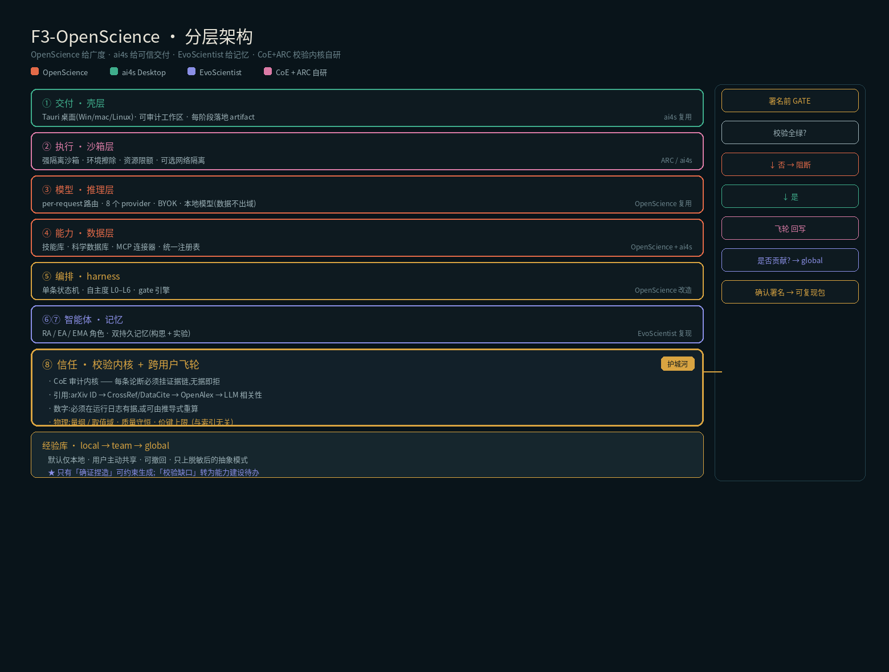

# ARCHITECTURE — 整合式开源科研 Agent

> 目标:整合四个开源项目的优势,打造一个 **Claude Science 的开源等价物 + 一条它没有的"自进化"腿**。
> 核心论点:开源阵营目前唯一缺的拼图是**产出前的独立校验**;把它补上,就是**第一个可能跨过"敢署名"门槛的开源科研 Agent**。
>
> 分层架构图:

---

## 0. 一句话战略

> OpenScience 给广度,ai4s 给可信交付,EvoScientist 给记忆,CoE+ARC 校验内核给信任。
> 四者并集 = 开源版 Claude Science;而**「校验记忆飞轮」是别人抄不走的复利护城河**。

---

## 1. 四个源项目 · 优势提炼(已 STORM 核实)

| 项目 | 身份 / 出处 | 可复用核心资产 | 复用方式 |
|---|---|---|---|
| **OpenScience**（synthetic-sciences/openscience） | Apache-2.0，Bun/TS，已发布 | 模型无关(75+ provider，per-request 路由，BYOK)、250+ 可编辑技能、~30 科学库(UniProt/PDB/ChEMBL/arXiv)、MCP + 科学连接器、浏览器工作台 + 本地 runtime、domain specialists(bio/physics/ml) | **直接复用**（广度基座） |
| **Open Science Desktop**（ai4s-research/open-science） | MIT 系，Tauri 2 + Rust/TS，766★，**ResearchClawBench Pass@1 第一（2026-07-09）** | 跨平台桌面(**含 Linux**)、可审计工作区、**每阶段落地可检视 artifact**、OpenCode sidecar、first-party review skills、SSH/WSL/GPU runtime、provenance | **直接复用**（可信交付层） |
| **EvoScientist** | arXiv 2603.08127（研究论文，非生产实现） | RA / EA / **EMA** 三角色 + **双持久记忆**(构思记忆 + 实验记忆，记成功与失败) + 三种自进化 | **只复现设计**（无开源许可，不集成代码） |
| **AutoResearchClaw** | arXiv 2605.20025，AIMING Lab，GitHub `calvyntwh/autoresearchclaw`，Python | 23 阶段流水线 + 5 大机制:多智能体辩论、自愈 PIVOT/REFINE、**4 层引用核验 + 反捏造**、7 档 HITL、跨运行经验库 | **复现 4 层核验机制**（自研实现，绕开许可证） |

> **STORM 修正（影响对外文章）**：ai4s Open Science Desktop 现已支持 **Linux**，且在 ResearchClawBench Pass@1 排**第一**——旧结论"无 Linux / 早期"已过时。

---

## 2. 决策日志（已拍板）

| # | 决策点 | 结论 |
|---|---|---|
| D1 | MVP 定位:自主 vs 协作 | **协作优先、自主可选**的单引擎双模式（AutonomyLevel L0–L6，MVP 默认 L1–L2） |
| D2 | 护城河聚焦 | **校验层 + 跨用户校验记忆飞轮**的耦合（80% 原创精力压在飞轮） |
| D3 | 经验库共享范围 | **跨用户 global，MVP 就上**（需先建脱敏 + 质量门 + 可撤回三件套） |
| D6 | 共享的决策权 | **用户主权:private-by-default + opt-in 分级共享**。经验默认仅本地，共享是显式动作，由用户按类别/单条自主选择范围，且可随时撤回 |
| D4 | MVP 领域 | **先打通用 ML/CS 研究**（数据源好接，校验重心=代码可复现） |
| D5 | 校验层实现路线 | **CoE 审计思路自研 + 复现 ARC 4 层核验，两者融合**（绕开 AutoResearchClaw 许可证阻塞） |

---

## 3. 分层架构（自下而上）

| 层 | 内容 | 来源 |
|---|---|---|
| ① 交付·壳层 | Tauri 桌面(Win/mac/Linux)· 可审计工作区 · artifact-per-stage | ai4s **复用** |
| ② 执行·沙箱层 | sandboxed venv · SSH/WSL/GPU runtime · 隔离执行 + 真实算力 | ARC/ai4s |
| ③ 模型·推理层 | per-request 路由 · 75+ provider · BYOK · 本地模型 [+可选:推理留域内] | OpenScience **复用** |
| ④ 能力·数据层 | 250+ skills · 30+ DB · MCP 连接器 · 统一 skill registry（带测试） | OpenScience + ai4s |
| ⑤ 编排·harness（单引擎双模式） | 一条 state-machine · AutonomyLevel L0–L6（ARC 7 档 HITL）· gate 引擎 | OpenScience **改造** |
| ⑥ 智能体·角色 + ⑦ 记忆·自进化 | RA/EA/EMA + 辩论角色 + domain specialists · 双持久记忆 | EvoScientist **复现** |
| **⑧ 信任·校验内核 + 跨用户飞轮 ★ 护城河** | **CoE Audit Kernel + ARC 4 层核验 + 校验记忆飞轮** | **CoE+ARC 融合 · 自研** |
| 经验库 | 三级 local → team → global（MVP 就上 global，强门控上行） | **自造** |

**新造的"胶水"（架构重点）**：统一 orchestration bus、统一 skill/memory/provenance schema、桌面壳 ↔ Python sidecar 的进程边界、双模式 UX。

---

## 4. 进程拓扑（异构语言栈边界）

```
ai4s Tauri 桌面壳 (Rust + React/TS) ── 复用
   │  IPC (JSON-RPC over stdio/socket)
Orchestrator (TS, Bun) ── OpenScience runtime 改造：唯一大脑
   │  state-machine · AutonomyLevel/gate · 模型路由
   ├── sidecar: CoE Audit Kernel (Python)
   ├── sidecar: Pipeline / 23 阶段 (Python)
   ├── 直连:   Skill/DB Registry (TS) ── OpenScience
   └── sidecar: 经验库服务 (Python) ── 本地 SQLite + global gRPC
```
**原则**：壳(Rust)不碰业务；Orchestrator(TS)是唯一大脑；Verifier/Pipeline/经验库是 Python sidecar（照 ai4s 的 OpenCode sidecar 模式，进程隔离、独立崩溃恢复）。**不硬融成一个进程。**

---

## 5. ⑤ 编排：单引擎双模式（D1）

自主度 = **一个可调参数**，不是两套代码。

```
单一 state-machine
 ├─ AutonomyLevel ∈ {L0…L6}   ← 复用 ARC 7 档 HITL
 │     L0 每步确认（协作） → L6 全自动（自主）
 ├─ Gate 引擎：在题目 / 实验设计 / 质量门 / 署名前插 checkpoint
 │     是否暂停 = f(AutonomyLevel, 该步风险)
 └─ 同一套阶段执行器（literature / hypothesis / code / verify / write）
```
**MVP 默认 L1–L2**：题目、实验设计、**署名前校验**三个 gate 强制暂停，其余自动。

---

## 6. ⑧ CoE Audit Kernel（自研内核，D5 · 护城河核心）

**融合本质**：CoE 定"什么必须有证据"（全覆盖门控），ARC 4 层是"引用证据"这根骨头的核验实现。两者都自研。

```
输入：draft + 所有 claim + 运行日志 / 数据表
├─ Step1 抽取：draft → atomic claims（引用型 / 数字型 / 图表型）
├─ Step2 挂链：每条 claim 强制绑一条 evidence_chain
│     引用型 → 文献指纹；数字型 → 运行日志行；图表型 → 生成代码 + 数据
├─ Step3 核验：
│     引用型 → ARC 4 层（arXiv ID → CrossRef/DataCite → Semantic Scholar → LLM 相关性）
│     数字型 → 重跑校验（同 seed/config 复现同值）← ML/CS 场景重心
│     图表型 → 图↔码一致性（数据回指）
└─ Step4 判定：无完整证据链 或 核验失败 → reject；可疑 → manual；全过 → pass
输出：verification_report.json（每 claim 三态 + evidence_ref）+ all_green
指标：对标 ScientistOne —— 目标 0 幻觉引用 / 数字 100% 可溯源
```
**关键设计**：校验器**不信任生成模型**（确定性检索/规则为主，LLM 只做相关性打分这一小步）——即"确定性审计，而非模型自律"。

---

## 7. 经验库 · 三级 + 跨用户飞轮（D2 + D3）

### 7.1 三级隔离
```
L1 local（默认，私有）：原始构思/实验/校验记忆，永不外发
L2 team（可选）：机构内共享
L3 global（opt-in）：只上"脱敏后的模式"，不上原始内容
   ↑ 上行强门控：脱敏(去 PII/未发表内容) → 质量门(≥N 次独立复现才晋升) → 可追溯/可撤回
```
> **为什么 global 存"模式"而非"想法"**：校验失败模式是通用的（假引用范式、无源数字场景），研究想法是私有的。**校验记忆比构思记忆更适合共享**——这是 D3 能安全落地的根因。

### 7.2 飞轮（★ 独家复利）
```
每次校验产生的"失败样本"（被拒假引用 / 被 flag 无源数字 / 图码不一致）
  → 自动写入 verify_lesson
  → 前置注入到 hypothesis & write 阶段（黑名单 / 规则）
  → 下次生成绕开历史雷区
  → 校验拦截率随使用下降，产出越来越"一次过"
```
ARC 的 lesson store 和 EvoScientist 的双记忆都只做了一半——**没有一家把"校验产出"喂回"生成记忆"**。这就是独家点。

### 7.3 用户主权 · 共享由用户决策（D6）

共享是**用户显式选择**，不是系统默认上行。四个要点：

1. **private-by-default**：用户积累的经验默认 `local`，永不自动外发；不点"贡献"就永远留本地。
2. **分级授权（可按类别 / 单条）**：
   ```
   ○ 仅本地(默认)        —— 谁也不给
   ○ 团队 / 机构内         —— 只给 team
   ○ 全局社区(opt-in)    —— 脱敏后进 global
   ```
   默认值对齐直觉：**校验记忆通常愿共享（通用、不涉隐私），构思记忆几乎不共享（私有想法）**。
3. **可撤回 + 可追溯**：用户可见自己贡献了什么、被多少人复用；随时可撤回（从 global 下架，衍生项来源失效）；记指纹不记身份（可匿名贡献）。
4. **贡献激励（可选，V2）**：取用 global 高质量经验的权重与贡献度挂钩，避免"只取不予"饿死飞轮；不强制、不影响基础功能。

> 与"晋升制"的关系：达到复现阈值**不再自动晋升 global**，而是**提示用户 → 用户同意 → 才脱敏晋升**。晋升门 = 质量门 **AND** 用户 consent。

---

## 8. 署名前 GATE（MVP 的心脏 · 三方交汇点）

```
Stage 「PRE_SIGNOFF_GATE」（强制，不可 --auto-approve 跳过）：
  1. CoE Kernel 跑完 → verification_report.all_green?
  2. 否 → 列出 reject/manual 项，暂停等人工介入
  3. 是 → 本次 reject/manual 模式 → 写入 verify_lesson（飞轮回写）
  4. 达 repro 阈值的 lesson → **提示用户是否贡献** → 用户同意 → 脱敏 → 晋升 team/global（不同意则留 local）
  5. 人工点"确认署名" → 产出可复现包
```
**这一个 gate 同时兑现**：协作把关（D1）+ 独立校验（D2/D5）+ 飞轮回写（D2）+ 隐私质量门（D3）+ **用户主权 consent（D6）**。**MVP 只要把它做扎实，定位与护城河同时立住。**

---

## 9. 数据 schema（global 版）

```sql
verify_lesson(id, kind ∈ {fake_cite, unsourced_num, fig_code_mismatch},
  pattern,                     -- 抽象模式（非原始内容）
  hit_count, repro_count,      -- ≥N 次独立复现才晋升 global
  scope ∈ {local, team, global},
  share_consent ∈ {none, team, global},   -- 用户授权范围（默认 none）；晋升需 consent
  contributor_fingerprint,                 -- 记指纹不记身份（可撤回/可匿名）
  reuse_count,                             -- 被复用次数（贡献度/激励用）
  decayed_weight, votes, status ∈ {active, retracted})

research_memory(id, kind ∈ {ideation, experiment},
  direction, outcome ∈ {success, fail}, artifact_ref, scope = local)   -- 私有为主

verification_report(run_id, claims JSONB,   -- 每 claim:{text, status, evidence_ref}
  citations_checked, citations_rejected, numbers_sourced, all_green, created_at)

global_promotion_log(lesson_id, from_scope, to_scope, repro_count, desensitized BOOL, user_consent BOOL, ts)  -- 晋升审计

user_share_policy(user_id, memory_kind ∈ {verify, ideation, experiment},
  default_scope ∈ {local, team, global})  -- 按类别的默认共享范围，可被单条覆盖
```

---

## 10. 许可证核查（开工前阻塞项）

| 项目 | 许可证 | 结论 |
|---|---|---|
| OpenScience | Apache-2.0 | ✅ 可直接用 |
| ai4s Open Science Desktop | MIT 系（待最终确认） | 大概率 ✅ |
| AutoResearchClaw | — | **走自研（复现 4 层机制），不集成代码** |
| EvoScientist | arXiv 论文 | **只复现设计** |

> D5 已把校验层改为自研 → **AutoResearchClaw 许可证不再是阻塞项**。剩余唯一待确认：ai4s 的确切许可证。

---

## 11. MVP 里程碑（可署名 + 飞轮双证明）

3–5 个真实 ML/CS 题目，产出草稿达到：
- **0 幻觉引用**（对标 ScientistOne 0/337）+ **数字 100% 可溯源**；
- 每个 gate 都有人可介入的检查点；
- **跑通一次跨用户闭环**：A 用户被拒模式 → 脱敏晋升 global → B 用户生成时前置规避；
- 第 5 个题目的校验拦截率**明显低于**第 1 个（证明飞轮转起来了）。

达成即证明:**开源第一个"产出前有独立校验、可署名"的科研 Agent，且飞轮 + 跨用户治理都立住。**
